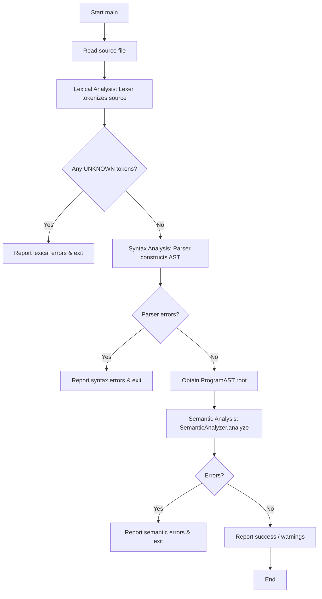

# Luc Compiler — AST Phase Flow Chart

This document describes the phases of the Luc compiler that involve the Abstract Syntax Tree (AST), starting from the `main` function. The AST phase includes **Syntax Analysis** (parsing) and **Semantic Analysis** (type checking, symbol resolution, and validation).

## Overall Compiler Flow (AST‑relevant parts)



## Detailed Sub‑steps of the AST Phase

### 1. Syntax Analysis (Parsing) – Building the AST

The `Parser` (in `src/parser/Parser.hpp` / `Parser.cpp`) reads the token list and builds a tree of AST nodes defined in `src/ast/`. The top‑level node is `ProgramAST`.

#### Parser entry point

```cpp
std::unique_ptr<ProgramAST> parser.parse();
```

#### What the parser does (simplified)

- Parses a `package` declaration → `PackageDeclAST`
- Parses zero or more `use` declarations → `UseDeclAST`
- Parses top‑level declarations (functions, structs, enums, traits, impls, type aliases, etc.) → each becomes a concrete `DeclAST` subclass (e.g., `FuncDeclAST`, `StructDeclAST`).
- For each declaration, the parser may parse nested type annotations (`TypeAST`), expressions (`ExprAST`), statements (`StmtAST`), and patterns (`PatternAST`).

All AST nodes inherit from `BaseAST`, which stores common fields:
- `ASTKind kind` – a quick discriminator (no RTTI)
- `SourceLocation loc` – file/line/column information
- `DocComment doc` – attached documentation comment
- Semantically annotated fields (filled later): `resolvedType`, `isBehaviorMember`, `isConst`, `scopeDepth`

#### Important AST families

- **TypeAST** – PrimitiveTypeAST, NamedTypeAST, NullableTypeAST, FixedArrayTypeAST, SliceTypeAST, DynamicArrayTypeAST, RefTypeAST, PtrTypeAST, FuncTypeAST
- **DeclAST** – PackageDeclAST, UseDeclAST, VarDeclAST, FuncDeclAST, StructDeclAST, EnumDeclAST, TraitDeclAST, ImplDeclAST, MethodDeclAST, FromDeclAST, TypeAliasDeclAST, etc.
- **ExprAST** – LiteralExprAST, IdentifierExprAST, CallExprAST, BinaryExprAST, PipelineExprAST, MatchExprAST, etc.
- **StmtAST** – BlockStmtAST, IfStmtAST, ForStmtAST, ReturnStmtAST, ParallelForStmtAST, etc.
- **PatternAST** – BindPatternAST, WildcardPatternAST, TypePatternAST, StructPatternAST

After parsing, the root `ProgramAST` contains:
- `packageName` (string)
- `filePath`
- `std::vector<DeclPtr> decls` – all top‑level declarations in source order.

### 2. Semantic Analysis – Walking the AST

The `SemanticAnalyzer` (`src/semantic/SemanticAnalyzer.hpp`) performs multiple passes over the AST using the `ASTVisitor` pattern. Because `BaseAST::accept(ASTVisitor&)` is virtual, each node dispatches to the correct `visit` overload.

#### High‑level semantic passes (as described in the codebase)

| Pass | Name | Responsibility |
|------|------|----------------|
| 1 | **Collector** | Build symbol tables: collect all declarations (packages, structs, functions, variables) into scopes. |
| 2 | **Type resolver** | Resolve type annotations: each `TypeAST` is linked to a concrete type (primitive, struct, etc.) and `BaseAST::resolvedType` is set. |
| 3a | **Type checker** | Walk every expression and statement, infer types, check operator compatibility, and enforce language rules (e.g., no `return` in parallel blocks). |
| 3b | **Method binding** | Connect calls to method declarations (impl resolution, trait conformance). |
| 4 | **Lifetime / ownership** (future) | Optional – not shown in current headers. |

The `SemanticAnalyzer::analyze(std::vector<ProgramAST*> files)` method orchestrates these passes. Errors and warnings are reported through the `DiagnosticEngine`.

#### Visitor hierarchy

All AST nodes override `accept(ASTVisitor&)`. The `ASTVisitor` base class (in `BaseAST.hpp`) defines an empty `visit(…)` for every concrete node type. Semantic passes subclass `ASTVisitor` and override only the methods they need.

Example:

- `SemanticCollector` (Pass 1) overrides `visit(FuncDeclAST&)` to insert the function into the symbol table.
- `TypeResolver` (Pass 2) overrides `visit(NamedTypeAST&)` to resolve the name and set `isGenericParam` if needed.
- `TypeChecker` (Pass 3a) overrides `visit(BinaryExprAST&)` to check operand types and set `resolvedType`.

## Summary of Key AST Nodes Involved in Each Phase

| Phase | Primary AST nodes created / visited |
|-------|--------------------------------------|
| Parsing | `ProgramAST`, `PackageDeclAST`, `UseDeclAST`, `FuncDeclAST`, `StructDeclAST`, `BlockStmtAST`, `ExprAST` subclasses, `TypeAST` subclasses |
| Semantic (Collector) | All `DeclAST` nodes – inserted into symbol tables |
| Semantic (TypeResolver) | All `TypeAST` nodes – resolve names, set `resolvedType` |
| Semantic (TypeChecker) | All `ExprAST` and `StmtAST` nodes – type inference, rule enforcement |

## Note on Compiler Directives (`@`)

Nodes for compiler directives are also part of the AST:
- `AttributeAST` – attached to declarations (`@extern`, `@inline`, etc.)
- `IntrinsicCallExprAST` – used in expressions (`@sizeof(T)`, `@memcpy`)

These are parsed and visited during semantic analysis to validate usage.

## Further Reading

- `BaseAST.hpp` defines the visitor pattern and common fields.
- `DeclAST.hpp`, `ExprAST.hpp`, `StmtAST.hpp`, `TypeAST.hpp` define all concrete node structures.
- The semantic passes are documented in `docs/LUC_SEMANTIC.md` (referenced in `BaseAST.hpp`).
