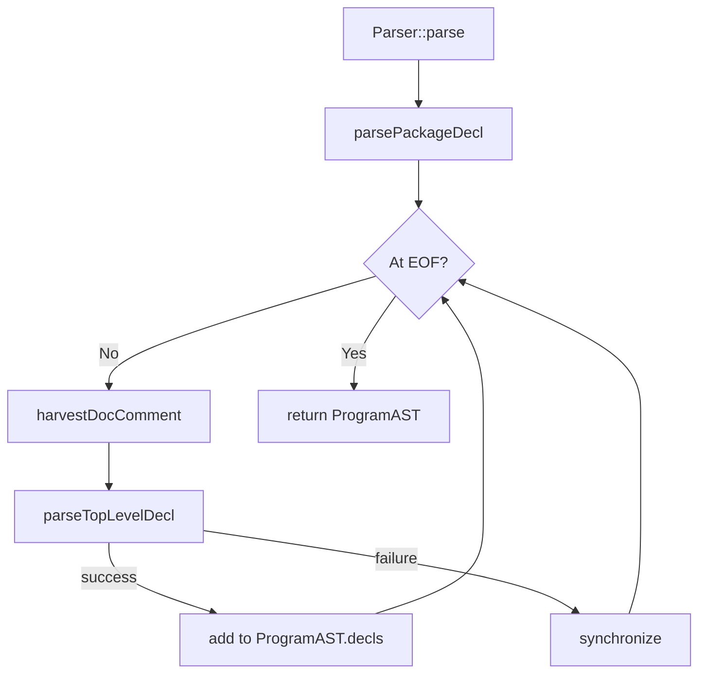

# Luc Compiler — Parser Phase Documentation

This document describes the **Syntax Analysis** (parsing) phase of the Luc compiler. The parser consumes a flat list of tokens produced by the lexer and builds an Abstract Syntax Tree (AST) rooted in `ProgramAST`. The implementation is a **recursive‑descent parser** with a **Pratt parser** for expressions, split across five translation units for maintainability.

## 1. Overview

| Input                     | Output                                  |
| ------------------------- | --------------------------------------- |
| `std::vector<Token>`      | `std::unique_ptr<ProgramAST>`           |
| DiagnosticEngine&         | (errors / warnings are recorded)        |

**Key responsibilities:**
- Verify syntactic correctness according to `LUC_GRAMMAR.md`
- Attach source locations to every AST node
- Collect documentation comments (`--` and `/-- --/`) and attach them to declarations
- Recover from errors (panic mode) to report multiple issues in one run

The parser never throws exceptions – all errors are routed to the `DiagnosticEngine`.

## 2. Main Entry Point: `Parser::parse()`

```cpp
std::unique_ptr<ProgramAST> Parser::parse();
```

**Steps:**

1. **Harvest doc comment** (if any) that appears before the `package` keyword.
2. **Parse package declaration** (`package foo`) → `PackageDeclAST`.
3. **Loop over top‑level declarations** until `EOF_TOKEN`:
   - Harvest any doc comment that precedes the declaration.
   - Call `parseTopLevelDecl()` (dispatches to the correct sub‑parser).
   - If parsing fails, call `synchronize()` to skip to the next declaration boundary.
4. Return the populated `ProgramAST`.

**Flow chart (Mermaid):**



## 3. Parser Architecture

The parser class (`Parser`) is declared in `Parser.hpp` and implemented in:

| File               | Responsibility                                      |
| ------------------ | --------------------------------------------------- |
| `Parser.cpp`       | Token stream primitives, error recovery, doc comment harvesting, `parse()` loop, visibility helpers |
| `ParserDecl.cpp`   | Top‑level declarations: `let/const`, `func`, `struct`, `enum`, `trait`, `impl`, `from`, `type`, `use`, attributes |
| `ParserExpr.cpp`   | Expressions (Pratt parser), patterns, match arms, pipelines, composition |
| `ParserStmt.cpp`   | Statements: blocks, `if`, `switch`, loops, `return`, `break`, `continue`, `parallel` |
| `ParserType.cpp`   | Type annotations: primitives, named types, arrays, references, pointers, function types |

All files include `Parser.hpp` and share the same class definition.

### 3.1 Token Stream Primitives

| Method                       | Description                                                       |
| ---------------------------- | ----------------------------------------------------------------- |
| `peek()`                     | Current token (skip `LINE_COMMENT`)                              |
| `advance()`                  | Consume and return current token (skip comments)                 |
| `check(TokenType)`           | True if current token matches type (no consume)                  |
| `match(TokenType)`           | If match, consume and return true                                |
| `consume(type, msg)`         | Expect token, report error if missing, return dummy token        |
| `isAtEnd()`                  | True if current token is `EOF_TOKEN`                             |

Comments are transparent to the grammar; `peek()` and `advance()` automatically skip `LINE_COMMENT` tokens. Block documentation comments (`DOC_COMMENT`) are harvested only by `harvestDocComment()` and are not seen by normal parsing.

### 3.2 Error Handling & Synchronization

- `errorAt(code, msg)` – records an error at the current token.
- `synchronize()` – skips tokens until a declaration or statement boundary is found (e.g., `let`, `const`, `if`, `struct`, `}`). Used after a parsing error to avoid cascading nonsense errors.

## 4. Parsing Top‑Level Declarations

`parseTopLevelDecl()` dispatches based on the current token:

```cpp
DeclPtr Parser::parseTopLevelDecl() {
    // 1. Collect leading '@' attributes
    // 2. Parse visibility modifier (pub / export)
    // 3. Dispatch:
    //    - 'use'        → parseUseDecl
    //    - 'struct'     → parseStructDecl
    //    - 'enum'       → parseEnumDecl
    //    - 'trait'      → parseTraitDecl
    //    - 'impl'       → parseImplDecl
    //    - 'from'       → parseFromDecl
    //    - 'type'       → parseTypeAliasDecl
    //    - 'let'/'const'→ looksLikeFuncDecl ? parseFuncDecl : parseVarDecl
    //    - else → error
}
```

### 4.1 Function vs. Variable Disambiguation

Because `let` / `const` can declare either a variable or a function, the parser uses `looksLikeFuncDecl()`:

- After the keyword and the name, look for an optional generic parameter list (`<...>`), then check if the next token is `'('`.  
- If yes → function declaration (`parseFuncDecl`).  
- Else → variable declaration (`parseVarDecl`).

## 5. Parsing Statements

Statements are parsed by `parseStmt()`, called inside `parseBlock()`.

**Dispatch priority:**

1. `let` / `const` → `parseLocalDecl()` (variable or function inside a block).
2. `if` → `parseIfStmt()` (statement form, `else` optional).
3. `switch` → `parseSwitchStmt()`.
4. `for` → `parseForStmt()`.
5. `while` → `parseWhileStmt()`.
6. `do` → `parseDoWhileStmt()`.
7. `return` → `parseReturnStmt()`.
8. `break` → `parseBreakStmt()`.
9. `continue` → `parseContinueStmt()`.
10. `parallel` → lookahead: if next token is `for` → `parseParallelForStmt()`, else → `parseParallelBlockStmt()`.
11. Else → treat as an expression statement (`ExprStmtAST`).

### 5.1 Contextual Depths

The parser maintains three counters to enforce semantic rules early:

| Variable          | Incremented in…                     | Checked in…                          |
| ----------------- | ----------------------------------- | ------------------------------------ |
| `asyncDepth_`     | `parseFuncBody` (async) / `parseAnonFuncExpr` (async) | `parseAwaitExpr` (must be >0)       |
| `loopDepth_`      | `parseForStmt`, `parseWhileStmt`, `parseDoWhileStmt` | `parseBreakStmt`, `parseContinueStmt` |
| `parallelDepth_`  | `parseParallelForStmt`, `parseParallelBlockStmt` | `parseAwaitExpr`, `parseReturnStmt`, `break`/`continue` |

## 6. Parsing Expressions (Pratt Parser)

Expression parsing is implemented in `ParserExpr.cpp` using a **top‑down operator precedence** (Pratt) parser.

### 6.1 Entry Points

| Function                     | Use                                                            |
| ---------------------------- | -------------------------------------------------------------- |
| `parseExpr()`                | Root – calls `parsePrattExpr(PREC_NONE)`                       |
| `parsePrattExpr(minPrec)`    | Core loop: parse prefix, then infix operators with precedence |
| `parsePrefixExpr()`          | Unary `-`, `not`, `~`, `&` or primary expression              |
| `parsePrimaryExpr()`         | Literals, identifiers, `match`, `if`, `await`, `@` intrinsics, anonymous functions, struct literals, grouped expressions |
| `parsePostfixExpr(lhs)`      | Applies post‑fix operators: `.`, `:`, `[ ]`, `( )`, `.?`      |

### 6.2 Precedence Levels (from lowest to highest)

| Level | Operators (examples)                       | Associativity |
| ----- | ------------------------------------------ | ------------- |
| 1     | `=`, `+=`, `-=`, `*=`, `/=`, `^=`, `%=`    | right         |
| 2     | `+>` (composition)                         | left          |
| 3     | `->` (pipeline)                            | left          |
| 4     | `??` (null coalescing)                     | right         |
| 5     | `or`                                       | left          |
| 6     | `and`                                      | left          |
| 7     | `==`, `!=`, `<`, `>`, `<=`, `>=`, `is`     | left          |
| 8     | `&&`, `\|\|`, `~^`, `<<`, `>>` (bitwise)   | left          |
| 10    | `+`, `-`                                   | left          |
| 11    | `*`, `/`, `%`                              | left          |
| 12    | `^` (exponentiation)                       | right         |

**Note:** Bitwise operators use `&&` (AND) and `||` (OR) to avoid confusion with the reference operator `&` and the union type separator `|`.

### 6.3 Postfix Operator Handling

After parsing the left‑hand side of an expression, `parsePostfixExpr` repeatedly checks for:

- `'(' args ')'` → `CallExprAST`
- `'<' genericArgs '>' '(' args ')'` → generic call
- `'[' expr ']'` or `'[' expr '..' expr ']'` → `IndexExprAST`
- `'.' identifier` → `FieldAccessExprAST`
- `'.?' identifier` → append step to a `NullableChainExprAST`
- Range `'..'` → handled separately (not in postfix).

### 6.4 Pipeline and Composition

- **Pipeline** (`->`) → `PipelineExprAST` – seed followed by one or more steps (ident, method ref, field ref, argument pack, anonymous function).
- **Composition** (`+>`) → `ComposeExprAST` – left side followed by one or more operands (ident, method ref, field ref). Compose is a compile‑time operation (type‑level).

Both are recognised inside the Pratt infix loop and invoke specialised parsers that consume the entire chain.

## 7. Parsing Types

All type annotations are parsed by functions in `ParserType.cpp`.

| Function            | Grammar examples                          |
| ------------------- | ----------------------------------------- |
| `parsePrimitiveType`| `int`, `float`, `string`, `any` …          |
| `parseNamedType`    | `Vec2`, `Buffer<int>`, `Map<K, V>`         |
| `parseArrayType`    | `[N]T` (fixed), `[]T` (slice), `[*]T` (dynamic) |
| `parseRefType`      | `&T` (safe reference)                      |
| `parsePtrType`      | `*T` (raw pointer, extern only)            |
| `parseFuncType`     | `(int) string`, `((int) string)?`          |

`parseType()` is the root entry point. After a type is parsed, `wrapNullable()` is called to attach an optional `?` suffix (except for `&T`, `*T`, and function types, which have their own nullable syntax).

## 8. Doc Comment Harvesting

`harvestDocComment()` scans backwards from the current position to attach comments according to the grammar rules:

1. **Block doc** (`/-- ... --/`) – a `DOC_COMMENT` token whose closing line is immediately above the declaration → attaches as `DocCommentForm::Block`.  
2. **Stacked** – consecutive `LINE_COMMENT` tokens with no blank lines between them and the declaration → `DocCommentForm::Stacked`.  
3. **Trailing** – a single `LINE_COMMENT` on the same line as the declaration (only if no stacked comments exist) → `DocCommentForm::Trailing`.

Priority: Block > Stacked > Trailing. Attached comments are stored in `BaseAST::doc`.

## 9. Example: Parsing a Simple Function

Consider:

```luc
-- Adds two numbers
let add (a int) (b int) int = a + b
```

1. `parseTopLevelDecl()` sees `let` → `looksLikeFuncDecl()` returns true because after `add` there is `(a int)`.
2. `parseFuncDecl`:
   - Name: `"add"`
   - No generic params.
   - Two param groups: `[a int]` and `[b int]`.
   - Return type: `int`.
   - Body: `parseFuncBody()` consumes `= a + b`.
     - Expression body form → creates `BlockStmtAST` with one `ReturnStmtAST` containing `BinaryExprAST` for `a + b`.
3. Doc comment `-- Adds two numbers` is attached to the `FuncDeclAST` via `harvestDocComment()`.

The resulting AST closely mirrors the source structure.

## 10. Summary of Key Parser Methods

| Method                     | Category           | Description                                      |
| -------------------------- | ------------------ | ------------------------------------------------ |
| `parse()`                  | Top‑level          | Entry point, builds `ProgramAST`                 |
| `parseTopLevelDecl()`      | Declarations       | Dispatcher for all top‑level constructs         |
| `parseStmt()`              | Statements         | Dispatcher for statements inside blocks         |
| `parseBlock()`             | Statements         | `{ ... }` – returns `BlockStmtAST`               |
| `parseExpr()`              | Expressions        | Pratt root, calls `parsePrattExpr(0)`            |
| `parsePrattExpr(minPrec)`  | Expressions        | Core precedence loop                             |
| `parseType()`              | Types              | Root for type annotations                        |
| `synchronize()`            | Error recovery     | Skip to next statement/declaration boundary      |
| `harvestDocComment()`      | Documentation      | Gathers preceding comments                       |

---
