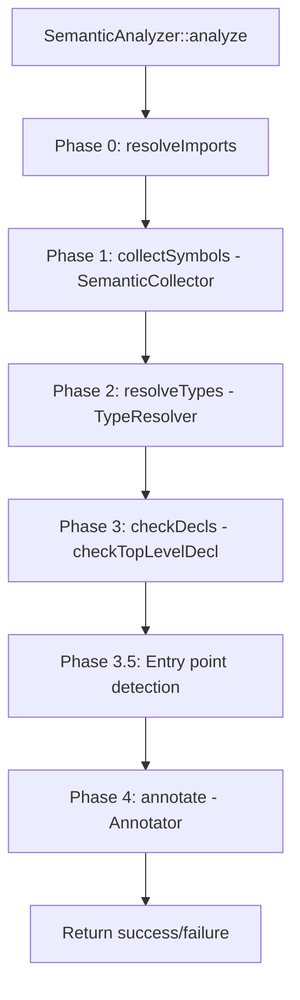

# Luc Compiler — Semantic Analysis Phase

This document describes the semantic analysis phase of the Luc compiler. The semantic phase is the third major stage after lexical analysis and parsing. It consumes the Abstract Syntax Tree (AST) produced by the parser and performs:

- Name resolution and symbol table construction
- Type resolution (validating type annotations)
- Type checking (expression and statement semantics)
- Constant propagation (`isConst` annotation)
- Entry point validation and compilation mode detection

The entry point is `SemanticAnalyzer::analyze()` in `SemanticAnalyzer.cpp`.

## 1. Overall Architecture

The semantic analysis is divided into **five sub‑phases** (0‑4), orchestrated by `SemanticAnalyzer`. Each phase is implemented as a separate AST visitor or set of functions.

### 1.1 Key Components

| Component             | Responsibility                                                                       |
| --------------------- | ------------------------------------------------------------------------------------ |
| `SymbolTable`         | Stack of scopes; stores `Symbol` objects for lookup during resolution and checking   |
| `TypeResolver`        | Walks `TypeAST` nodes, resolves named types to symbols, validates generic params     |
| `TypeChecker`         | Static utility functions: `isAssignable`, `unify`, `isNullable`, primitive widening  |
| `SemanticCollector`   | Phase 1 visitor: collects top‑level symbols (structs, functions, enums, traits, …)  |
| `SemanticDecl.cpp`    | Phase 3 helpers: checks declarations, attributes, external linkage                  |
| `SemanticExpr.cpp`    | Phase 3 helpers: type‑checks every expression and sets `resolvedType`               |
| `SemanticStmt.cpp`    | Phase 3 helpers: checks statements, manages scopes, return validation               |
| `Annotator`           | Phase 4 visitor: stamps `isConst` and propagates constantness                       |
| `IntrinsicRegistry`   | Table of built‑in `@` intrinsics (sizeof, sqrt, memcpy, …) used by type checker     |

## 2. Phase 0 – Resolve Imports

- **Purpose**: Detect duplicate `use` declarations and circular imports (basic detection).
- **Implementation**: `SemanticAnalyzer::resolveImports()`
- **Logic**: For each file, collect the full path of every `UseDeclAST` and report an error if the same path appears twice. No file‑system resolution is performed – that is left for a later linker/package phase.

## 3. Phase 1 – Collect Symbols (`SemanticCollector`)

- **Purpose**: Populate the global `SymbolTable` with every top‑level declaration so that other phases can resolve names.
- **Implementation**: `SemanticCollector` – an `ASTVisitor` that overrides `visit()` for all declaration nodes.
- **What is collected**:
  - `PackageDeclAST` (stores package name in `ProgramAST`, not as a symbol)
  - `UseDeclAST` – not added to symbol table (handled separately)
  - `VarDeclAST` – added as `SymbolKind::Var` or `ExternFunc` if `@extern`
  - `FuncDeclAST` – added as `SymbolKind::Func` or `ExternFunc`; also builds a minimal function signature (`FuncTypeAST`) for type checking
  - `StructDeclAST` – added as `SymbolKind::Struct`; **self‑type synthesis** creates a `NamedTypeAST` in `StructDeclAST::selfType` so that struct literals have a type.
  - `EnumDeclAST` – added as `SymbolKind::Enum`; each variant as `SymbolKind::EnumVariant`
  - `TraitDeclAST` – added as `SymbolKind::Trait`; methods are added with mangled names (`Trait.method`)
  - `ImplDeclAST` – methods are added with mangled names (`Struct.method`)
  - `FromDeclAST` – each `FromEntryAST` gets a unique mangled name (`TargetType.from.<ptr>`) as `SymbolKind::Casting`
  - `TypeAliasDeclAST` – added as `SymbolKind::TypeAlias`

- **Self‑type synthesis for structs**:  
  Before this fix, `Symbol::type` for a struct was `nullptr`, causing false type errors in assignments. Now `SemanticCollector::visit(StructDeclAST)` creates `node.selfType = std::make_unique<NamedTypeAST>(node.name)` and stores that pointer in the symbol’s `type` field. The `mutable` and `unique_ptr` allow lazy initialisation from a const visitor.

## 4. Phase 2 – Resolve Types (`TypeResolver`)

- **Purpose**: Validate every type annotation and convert raw `TypeAST` nodes into resolved types (by linking named types to symbol table entries).
- **Implementation**: `TypeResolver` – an `ASTVisitor` that walks `TypeAST` subtrees.
- **Important rules**:
  - Primitive types are always valid.
  - Named types must refer to a `Struct`, `Enum`, `Trait`, or `TypeAlias` symbol.
  - Generic type parameters (e.g. `T` in `struct Box<T>`) are recognised when `genericParams_` is set on the resolver. They are marked with `NamedTypeAST::isGenericParam = true`.
  - Type aliases are transparently unwrapped.
  - Raw pointers `*T` are **only** allowed when `insideExtern_ == true` (i.e. inside an `@extern`‑decorated declaration). The semantic pass reports an error otherwise.
  - Array sizes must be > 0.
- **External context**: `checkFuncDecl` / `checkVarDecl` set `resolver.setInsideExtern(true)` before resolving types of `@extern` declarations.

## 5. Phase 3 – Check Declarations, Expressions, Statements

This is the main type‑checking phase, split across three C++ files. All three share the same recursive descent structure and use the `SymbolTable` and `TypeResolver` that were built earlier.

### 5.1 Dispatcher – `checkTopLevelDecl` (`SemanticDecl.cpp`)

Calls the appropriate checking function:

- `checkVarDecl`  
- `checkFuncDecl`  
- `checkStructDecl`  
- `checkEnumDecl`  
- `checkTraitDecl`  
- `checkImplDecl`  
- `checkFromDecl`

### 5.2 Declaration Rules (Selection)

- **`checkVarDecl`**  
  - Resolves declared type and initialiser type.  
  - `const` requires an initialiser that is a compile‑time constant (checked with `isConstExpr`).  
  - `nil` only assignable to nullable types.  
  - If a `from`‑casting block exists for the target type, the initialiser is automatically wrapped in a `TypeConvExprAST` (desugaring).  
  - `@extern` variables must not have an initialiser.

- **`checkFuncDecl`**  
  - Resolves parameter and return types.  
  - Pushes a function scope and declares parameters.  
  - Checks the body with the expected return type.  
  - Handles curried functions (multiple parameter groups).  
  - For `@extern` functions: validates that the body is absent or empty (warning for empty body, error for non‑empty body).

- **`checkStructDecl`**  
  - Resolves field types.  
  - Reports duplicate field names.  
  - Checks field default value types.

- **`checkEnumDecl`**  
  - Assures explicit values are unique; auto‑assigns values sequentially.

- **`checkTraitDecl`**  
  - Resolves method parameter/return types.  
  - No duplicate method names.

- **`checkImplDecl`**  
  - Verifies the target struct exists.  
  - Checks generic signature matches the struct’s generic parameters.  
  - For each method, injects struct fields into the method’s scope, then checks the method body.  
  - **Memory safety note**: The method loop re‑lookups the struct symbol after `pushScope()` because `std::vector` of scopes may reallocate, invalidating earlier pointers.  
  - Trait conformance check (if a trait is provided) verifies all required methods are implemented in this `impl` block. (Multiple impl blocks are allowed; only the current block’s methods are checked, but an empty block passes.)

- **`checkFromDecl`**  
  - Validates target type exists.  
  - For each entry: resolves parameter types, checks bodies, and ensures there is no duplicate signature (same curry group shapes) within the block.

### 5.3 Attribute Validation

Function `checkAttributes` validates `@` directives:

- `@extern("sym")` / `@extern("sym","conv")` – only on functions or variables, requires `const` (emits warning if `let` is used instead), at most 2 string arguments.
- `@inline`, `@noinline` – only on functions, no args.
- `@packed` – only on structs, no args.
- `@deprecated("msg")` – optional string argument.
- `@aot`, `@jit` – only on the `main` entry point (enforced in Phase 3.5), mutually exclusive.

### 5.4 Expression Type Checking (`SemanticExpr.cpp`)

The main entry point is `checkExpr`, which dispatches based on `ASTKind`. Each handler returns the `TypeAST*` that the expression evaluates to and stores it in `node->resolvedType`. Key expression checks:

- **Literals**: map to primitive types; `nil` yields `nullptr`.
- **Identifiers**: look up in symbol table – return the symbol’s type.
- **Field access**: resolves object type, then looks up field in struct or enum.
- **Behavior access (`Type:method`)**: resolves the method, strips the implicit `self` parameter type, and stamps codegen annotations (`concreteTypeArgs`, `resolvedMangledName`). Disallows static (type‑side) use of `:` – left side must be an instance.
- **Binary operators**: 
  - Logical `and`/`or` require `bool` or nullable types.
  - Value equality `==`/`!=` forbids structs (E3011), functions (E3012), arrays (E3013); delegates to value comparison.
  - Reference equality `===` only allowed on reference types and structs.
  - Bitwise operators require integer types.
  - Arithmetic operators perform type unification.
- **Unary operators**: `not` requires `bool`/nullable; `-`, `~`, `&` are checked for operand types.
- **Calls**: resolve callee to a function type, check argument counts and types. Supports partial application and currying. Handles explicit generic calls (e.g. `process<int>(x)`). Recognises struct constructors (from‑casting) and returns the struct type.
- **Assignments**: enforce LHS is mutable (`let` variable, not `const`). Compound assignments are desugared. Function body reassignment (`f = { ... }`) is detected and uses the original function’s signature.
- **If‑expressions**: both branches must unify.
- **Match expressions**: each arm’s patterns introduce bindings; arm bodies must unify; `default` arm is required.
- **Pipeline (`->`)**: each step must be callable; the type of the seed flows through.
- **Composition (`+>`)**: each operand must be a function; output type of left must match input type of right.
- **Indexing**: validates that index is an integer; resolves element type from array type.
- **Type casts**: safe casts (`float(x)`) are always allowed; unsafe casts (`*T(x)`) are only allowed inside `@extern`.
- **Intrinsics (`@`)** : driven by `IntrinsicRegistry` – validates name, argument kinds, return type, and argument count.

### 5.5 Statement Checking (`SemanticStmt.cpp`)

Entry point `checkStmt`. Important behaviour:

- **Block**: pushes a new scope, records `scopeDepth` on the node, checks each statement, then pops the scope.
- **If‑statement**: checks condition (must be `bool` or nullable). Implements type narrowing for `x is T` patterns.
- **Switch‑statement**: checks subject type and case value types.
- **Loops (`for`, `while`, `do-while`)**: increment `loopDepth`, declare loop variable, check body.
- **Return**: validates that the return value type matches the enclosing function’s expected return type. `return` is not allowed inside parallel scopes.
- **Break / Continue**: only allowed when `loopDepth > 0` and not inside parallel scope.
- **Parallel constructs** (`parallel for`, `parallel { ... }`): increment `parallelDepth`, prevent `await`, `return`, `break`, `continue` inside the body (enforced by the respective checking functions). Also prevent writes to outer variables (checked at assignment points).

### 5.6 Type Narrowing

When an `if` condition is an `IsExprAST` (`x is T`), the semantic pass pushes a new scope for the `then` branch and declares a copy of the symbol `x` with the narrowed type `T`. This allows direct access to `T`‑specific fields inside the branch.

### 5.7 Compile‑Time Constants (`isConst`)

During Phase 3, the predicate `isConstExpr` is used to verify that `const` initialisers are constant. It recognises:
- Literals (except `nil`)
- Identifiers declared with `const`
- Enum variant accesses
- Arithmetic/bitwise/unary expressions where all operands are constant
- Safe type casts of a constant expression

Actual annotation of the `isConst` flag on AST nodes is deferred to **Phase 4**.

## 6. Phase 3.5 – Entry Point Detection

After Phase 3, `SemanticAnalyzer::analyze` performs dedicated checks on the `main` function:

- Must exist.
- Must be `export const main`.
- Must have zero parameters **or** a single parameter of type `[]string` (slice of strings) to receive command‑line arguments.
- Must return `int`.
- Must not be `async`.
- May have `@aot` (default) or `@jit` attributes – but not both.

The compilation mode (`AOT` or `JIT`) is stored in `SemanticAnalyzer::compilationMode_` for later use by the driver and codegen.

The function also verifies that `@aot` / `@jit` only appear on `main`.

## 7. Phase 4 – Annotate (`Annotator`)

- **Purpose**: Stamp the `isConst` (and reinforce `isBehaviorMember`) flags on every AST node **after** all semantic checks are done.
- **Implementation**: `Annotator` class in `Annotator.cpp` – an `ASTVisitor` that performs a **post‑order** walk, so child `isConst` flags are known when processing a parent.
- **Rules**:
  - Literals (except `nil`) → `isConst = true`.
  - `const` variables / functions → `isConst = true`.
  - Enum declarations and variants → `isConst = true`.
  - Binary/Unary/Range/FieldAccess/TypeConv expressions → `isConst = true` when all operands are constant.
  - Calls, assignments, pipelines, match, if‑expr, await → `isConst = false`.
  - `@sizeof` and `@alignof` → `isConst = true` (compile‑time type queries).
  - `isBehaviorMember` is set on `BehaviorAccessExprAST` (already done in Phase 3, but re‑affirmed for safety).

This pass does **not** modify `resolvedType` or `scopeDepth` – those are written during Phase 3.

## 8. Utility Components

### 8.1 `TypeChecker` (static functions)

- `isAssignable(from, to)`: checks primitive widening, nullable assignment, structural equality, and `any` compatibility.
- `unify(a, b)`: returns the most specific common supertype for branches.
- `isNullable(type)`: works for `NullableTypeAST` and nullable `FuncTypeAST`.
- `isValueComparable(type)`: used by `==` / `!=`.
- `isReferenceComparable(type)`: used by `===`.
- `isBoolOrNullable(type)`: used by `not`, `and`, `or`.
- `isFromCastable(src, target, symbols)`: searches for a `from` casting entry that can convert `src` to `target`.

### 8.2 `IntrinsicRegistry`

A compile‑time table (`IntrinsicRegistry::kEntries`) that describes every `@` intrinsic known to the compiler. Each entry includes:

- Luc name (e.g. `"sqrt"`)
- LLVM intrinsic name (e.g. `"llvm.sqrt"`)
- Argument kinds (`TypeArg`, `AnyValue`, `IntValue`, `FloatValue`, `PtrValue`, `SizeValue`)
- Return kind (`Void`, `Uint64`, `Float32`, `Float64`, `SameAsArg0`, … )
- Min/max argument counts
- Overloaded flag

This registry is **only used by the semantic checker** to validate intrinsic calls (`SemanticExpr.cpp`). The codegen phase will later use the same registry to know which LLVM intrinsic to emit.

### 8.3 `SymbolTable` and Scopes

- `scopes_` is a `std::vector<std::unordered_map<std::string, Symbol>>`.
- `pushScope` / `popScope` manage lexical nesting.
- `declare` inserts a symbol into the innermost scope; returns `false` if the name already exists in that same scope.
- `lookup` searches from innermost to outermost.
- `findSymbolsByPrefix` (used for `from`‑casting lookup) returns all symbols whose name begins with a given prefix (e.g. `"Vec2.from."`).

## 9. Error and Warning Codes

The semantic phase uses diagnostic codes from `DiagnosticCodes.hpp` with the prefix `E3xxx` for errors and `W3xxx` for warnings. Examples:

- `E3001` – Undeclared identifier / type
- `E3002` – Type mismatch / invalid operation
- `E3003` – Wrong number of arguments
- `E3004` – Assignment to `const` variable
- `E3005` – Duplicate symbol / name
- `E3006` – Missing `main` entry point
- `E3007` – Invalid `main` signature
- `E3008` – Type conversion failure
- `E3009` – Unknown intrinsic
- `E3010` – Intrinsic argument error
- `E3011` – Cannot use `==` on struct
- `E3012` – Cannot use `==` on function
- `E3013` – Cannot use `==` on array
- `E3015` – `@aot` / `@jit` mutually exclusive
- `E3016` – Compilation directive only allowed on `main`
- `E3017` – Generic signature mismatch
- `W3001` – `@extern` should use `const` (not `let`)
- `W3002` – Empty body on `@extern` function
- `W3003` – Operation on nullable type may be nil

## 10. Summary Flow (from `main`)

When the compiler driver calls `SemanticAnalyzer::analyze` with a vector of `ProgramAST*`:

1. **Phase 0** – Scan all `use` declarations for duplicates.
2. **Phase 1** – `SemanticCollector` walks every file and builds the global symbol table.
3. **Phase 2** – `TypeResolver` processes every type annotation (lazy – called on demand).
4. **Phase 3** – `checkDecls` recursively validates all declarations, expressions, and statements, filling in `resolvedType`, `scopeDepth`, and reporting any semantic errors.
5. **Phase 3.5** – Verify the `main` entry point and determine compilation mode.
6. **Phase 4** – `Annotator` stamps `isConst` flags.
7. If no errors have been recorded, the AST is now fully annotated and ready for code generation.

---
